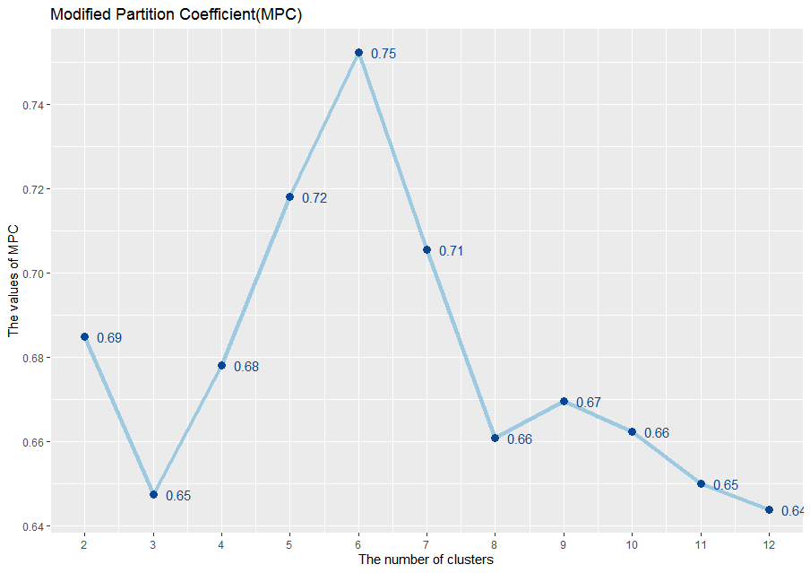
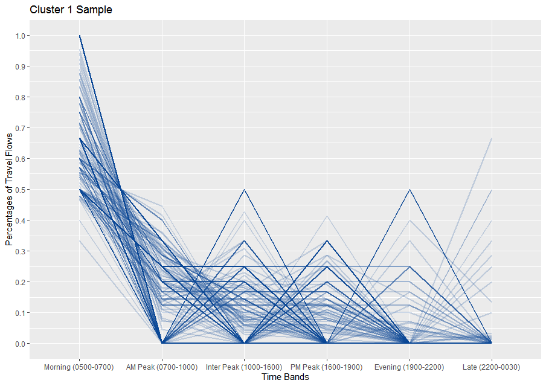
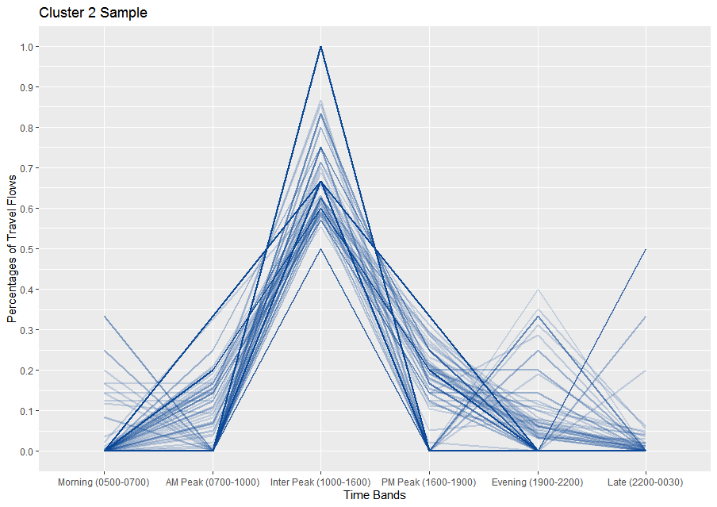
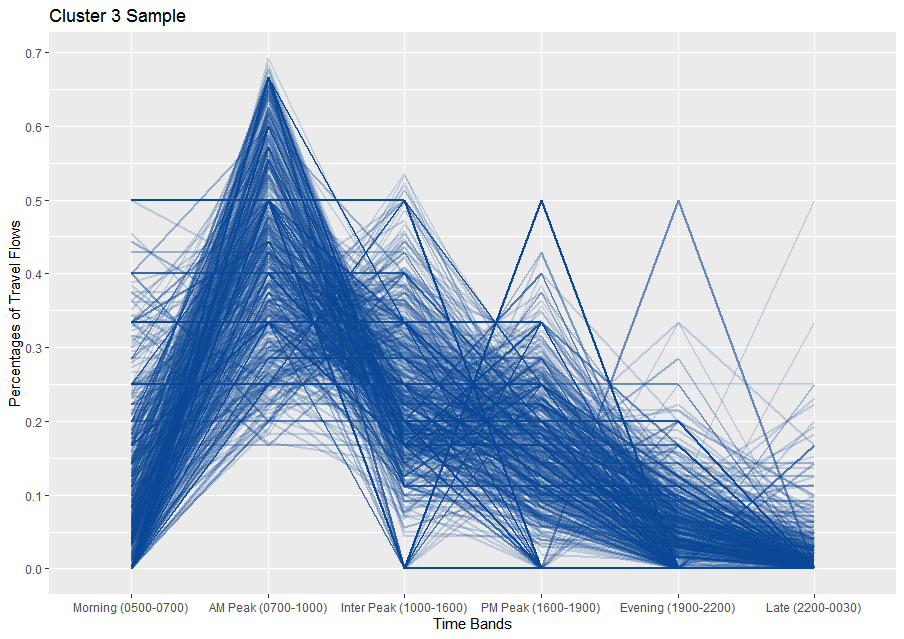
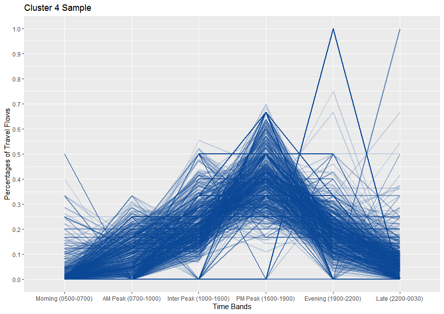
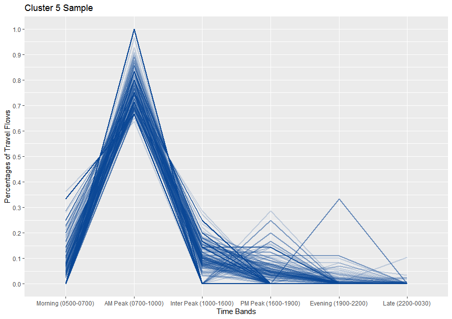
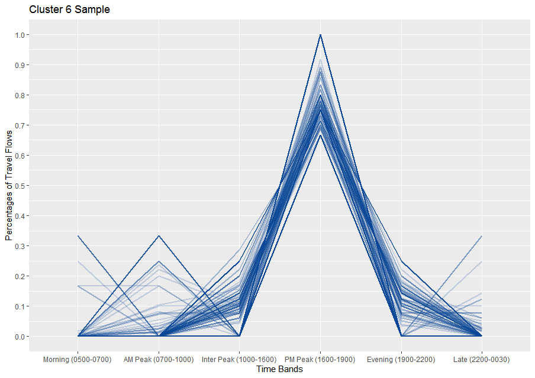

```{r setup, include=FALSE}
knitr::opts_chunk$set(echo = TRUE)
```


## Data Process

Transform and clean the MTT(Monday to Thursday) origin and destination data before analysis

```{r}
library(readr)
library(dplyr)
library(tidyr)

# Read the data
  ## OD_network
OD <- read_csv("Data/MTT.csv")

  ## coordinates of stations
stations <- read_csv("Data/London stations2.csv")


# Join the two dataset
  ## Join origin coordinates
ODwithCoordinates <-  merge(OD,
                            stations,
                            by.x = "Origin Station Name",
                            by.y = "Station")

  ## Join destination coordinates
ODwithCoordinates <-  merge(ODwithCoordinates,
                            stations,
                            by.x = "Destination Station Name",
                            by.y = "Station")


# Clean the data
  ## Drop unnecessary columns
OD_cleaned <- ODwithCoordinates[,c(2,1,7:15,18,19,24,25)]

  ## Renamed column
names(OD_cleaned)[12:15] <- c("O_Latitude","O_Longitude","D_Latitude","D_Longitude")

  ## Correcting the total number
OD_cleaned[3] <- rowSums(OD_cleaned[,4:11])

  ## Extract the observations over 0 (or it will take too long to process)
OD_cleaned_shrink <- OD_cleaned[OD_cleaned[3]>0,]

  ## Standardized 1
for(i in c(4:11)){
  OD_cleaned_shrink[i] <- OD_cleaned_shrink[i]/OD_cleaned_shrink[3]
}
```


## Determine the Optimal Cluster Number

```{r}
library(ppclust)
library(factoextra)
library(cluster)
library(fclust)
library(e1071)
library(ggplot2)
library(RColorBrewer)

# Define the range of clusters number to test
Clu_num <- c(2:12)


# Define function using modified partition coefficient(MPC) to calculate the MPC of each cluster number
Clu_MPC <- function(data){
  
  ## MPC array
  MPC_Arr <- Clu_num
  
  ## Run cluster algorithm and calculater the MPC
  for (i in Clu_num){
    
    ## Cluster result
    Cluster_result <- cmeans(data[,4:9],i,m = 1.5)
  
    ## Modified Partition Coefficient
    MPC_Arr[i-1] <- MPC(Cluster_result$membership) 
  
  print(MPC_Arr[i-1])
  }
  
  ## return MPC array
  return (MPC_Arr)
}

# The MPC array
MPC_Arr <- Clu_MPC(OD_cleaned_shrink)

  ## Join the number of clusters to MPC array
MPC <- data.frame(Clu_num,MPC_Arr)


# Plot the MPC curve
MPC_Clu <- ggplot(MPC,aes(x=Clu_num, y = MPC_Arr))+
  geom_line(color=brewer.pal(7,"Blues")[3],size=1.5)+
  geom_point(color=brewer.pal(7,"Blues")[7],size=3)+
  geom_text(color=brewer.pal(7,"Blues")[7],aes(label = round(MPC_Arr,2), hjust = -0.5))+
  scale_x_continuous(breaks=c(2:12))+
  scale_y_continuous(breaks=seq(round(min(MPC$MPC_Arr),2),round(max(MPC$MPC_Arr),2),0.02))+
  labs(title="Modified Partition Coefficient(MPC)",
       x="The number of clusters",
       y="The values of MPC")

  ## the MPC curve can be different because of the random initialisation of cmeans clustering
  ## MPC_Clu But I'll use the one generated before instead

```


## The Temporal Patterns of Clusters

```{r}
library(ggplot2)
library(reshape2)

# Store the cluster result
  ## Cluster result
Cluster_result <- cmeans(OD_cleaned_shrink[,4:9],6,m = 1.5)

  ## Join in the cluster number
OD_cleaned_shrink_clustered <- cbind(OD_cleaned_shrink,data.frame(Cluster_result$cluster))


# Visualise the pattern
  ##Define a function to draw the patterns
Draw_pattern <- function(cluster_Num_sample,Clu_Num){
  cluster_Num_sample <- cbind(cluster_Num_sample,rownames(cluster_Num_sample))
  cluster_Num_sample <- melt(cluster_Num_sample,id.vars=17,measure.vars=4:9)
  names(cluster_Num_sample) <- c("X1","X2","X3")
  
  
  cluster_P <- ggplot(cluster_Num_sample,aes(x=X2,y=X3,group=X1))+
    geom_line(color=brewer.pal(7,"Blues")[7],size=1,alpha=0.2)+
    scale_y_continuous(breaks=c(0:10)/10)+
    labs(title=paste("Cluster",Clu_Num,"Sample"),
         x="Time Bands",
         y="Percentages of Travel Flows")
  
  return (cluster_P)
}

colnames(OD_cleaned_shrink_clustered)[16]="Cluster_result"


# Produce the clusters plot
## cluster 1
cluster_1 <- OD_cleaned_shrink_clustered[OD_cleaned_shrink_clustered[16]== 1,]
cluster_1_sample <- cluster_1[sample(rownames(cluster_1),1000),]
cluster_P1 <- Draw_pattern(cluster_1_sample,'1')

## cluster 2
cluster_2 <- OD_cleaned_shrink_clustered[OD_cleaned_shrink_clustered[16]== 2,]
cluster_2_sample <- cluster_2[sample(rownames(cluster_2),1000),]
cluster_P2 <- Draw_pattern(cluster_2_sample,'2')

## cluster 3
cluster_3 <- OD_cleaned_shrink_clustered[OD_cleaned_shrink_clustered[16]== 3,]
cluster_3_sample <- cluster_3[sample(rownames(cluster_3),1000),]
cluster_P3 <- Draw_pattern(cluster_3_sample,'3')

## cluster 4
cluster_4 <- OD_cleaned_shrink_clustered[OD_cleaned_shrink_clustered[16]== 4,]
cluster_4_sample <- cluster_4[sample(rownames(cluster_4),1000),]
cluster_P4 <- Draw_pattern(cluster_4_sample,'4')

## cluster 5
cluster_5 <- OD_cleaned_shrink_clustered[OD_cleaned_shrink_clustered[16]== 5,]
cluster_5_sample <- cluster_5[sample(rownames(cluster_5),1000),]
cluster_P5 <- Draw_pattern(cluster_5_sample,'5')

## cluster 6
cluster_6 <- OD_cleaned_shrink_clustered[OD_cleaned_shrink_clustered[16]== 6,]
cluster_6_sample <- cluster_6[sample(rownames(cluster_6),1000),]
cluster_P6 <- Draw_pattern(cluster_6_sample,'6')
```

          






## The Spatial Patterns of Clusters
```{r}
library(tmap)
library(sf)
library(maptools)
library(leaflet)
library(spatstat)
library(sp)
tmap_mode("view")


# Read in base map
London_Boundary <- st_read("Data/London boundary/ESRI/London_Borough_Excluding_MHW.shp")


# Difine a function of creating cluster into different sf
Cluster_SF <- function(ODs,Clu_Num){
  ODs <- ODs[ODs["Cluster_result"]==i,]
  ## This lines are run only to reduce the data size so that the upload can be done
  ODs <- ODs[sample(rownames(ODs),0.7*nrow(ODs)),]
  ## Convert the cluster result into sp
  Cluster_Map <- psp(ODs[,'O_Longitude'],
                     ODs[,'O_Latitude'],
                     ODs[,'D_Longitude'],
                     ODs[,'D_Latitude'],
                     owin(range(c(ODs[,'O_Longitude'], ODs[,'D_Longitude'])),
                          range(c(ODs[,'O_Latitude'], ODs[,'D_Latitude']))))
  
  Cluster_Map <- as(Cluster_Map, "SpatialLines") 
  
  ## Cleaned the data a littes
  rownames(ODs) <- 1:length(Cluster_Map)
  ODs[,17] <- paste(ODs[,1],"to",ODs[,2])
  colnames(ODs)[16:17] <- c("Cluster_result","OD")
  
  ## Convert the cluster result into sf
  Cluster_Map <- SpatialLinesDataFrame(Cluster_Map,data = ODs)
  proj4string(Cluster_Map) <- CRS("+proj=longlat +datum=WGS84 +no_defs +ellps=WGS84 +towgs84=0,0,0 ")
  
  return(Cluster_Map)
}


# Array of Cluster_Map
Cluster_Map <- list(1:6)
for(i in 1:6){
  Cluster_Map[i] <- Cluster_SF(OD_cleaned_shrink_clustered,i)
}


# Base map
London_Base <- tm_shape(London_Boundary)+
  tm_polygons("NAME",
              legend.show = FALSE,
              palette = 'black',
              alpha = 0.05)


# Map 
Mapping <- 
  tm_shape(Cluster_Map[[1]]) + 
  tm_lines("Total",
           title.col = "Travel Flows of Cluster1(Capita)",
           lwd = "Total",
           scale = 20,
           style = "jenks",
           alpha = 0.8,
           id = "OD", 
           popup.vars=c("Total","Origin Station Name","Destination Station Name"),
           group = "Cluster1"
  )+
  tm_shape(Cluster_Map[[2]])+
  tm_lines("Total",
          title.col = "Travel Flows of  Cluster2(Capita)",
          lwd = "Total",
          scale = 20,
          palette = "Blues",
          style = "jenks",
          alpha = 0.8,
          id = "OD", 
          popup.vars=c("Total","Origin Station Name","Destination Station Name"),
          group = "Cluster2"
  )+
  tm_shape(Cluster_Map[[3]])+
  tm_lines("Total",
           title.col = "Travel Flows of Cluster3(Capita)",
           lwd = "Total",
           scale = 20,
           palette = "Reds",
           style = "jenks",
           alpha = 0.8,
           id = "OD", 
           popup.vars=c("Total","Origin Station Name","Destination Station Name"),
           group = "Cluster3"
  )+
  tm_shape(Cluster_Map[[4]])+
  tm_lines("Total",
           title.col = "Travel Flows of Cluster4(Capita)",
           lwd = "Total",
           scale = 20,
           palette = "Purples",
           style = "jenks",
           alpha = 0.8,
           id = "OD", 
           popup.vars=c("Total","Origin Station Name","Destination Station Name"),
           group = "Cluster4"
  )+
  tm_shape(Cluster_Map[[5]])+
  tm_lines("Total",
           title.col = "Travel Flows of Cluster5(Capita)",
           lwd = "Total",
           scale = 20,
           style = "jenks",
           palette = "Greens",
           alpha = 0.8,
           id = "OD", 
           popup.vars=c("Total","Origin Station Name","Destination Station Name"),
           group = "Cluster5"
  )+
  tm_shape(Cluster_Map[[6]])+
  tm_lines("Total",
           title.col = "Travel Flows of Cluster6(Capita)",
           lwd = "Total",
           scale = 20,
           style = "jenks",
           palette = "Greys",
           alpha = 0.8,
           id = "OD", 
           popup.vars=c("Total","Origin Station Name","Destination Station Name"),
           group = "Cluster6"
  )
  


London_Base+Mapping
```


